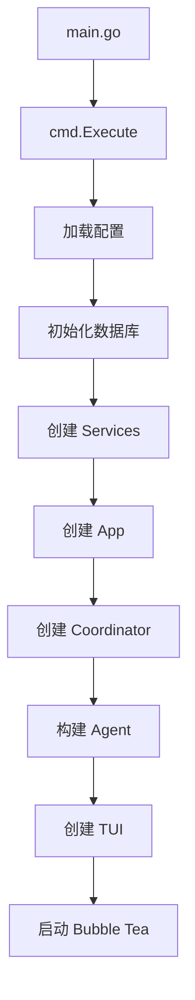

# Crush 项目学习指南

> 🚀 一份完整的 Charmbracelet Crush 源码学习指南
> 
> **项目评分：8.5/10** | **推荐指数：⭐⭐⭐⭐⭐**

---

## 📋 目录

1. [项目概述](#1-项目概述)
2. [前置知识](#2-前置知识)
3. [环境搭建](#3-环境搭建)
4. [项目架构全景](#4-项目架构全景)
5. [学习路径（分阶段）](#5-学习路径分阶段)
6. [核心模块深度解析](#6-核心模块深度解析)
7. [实战练习建议](#7-实战练习建议)
8. [进阶话题](#8-进阶话题)
9. [学习资源](#9-学习资源)

---

## 1. 项目概述

### 1.1 Crush 是什么？

**Crush** 是一个运行在终端中的 AI 编程助手，由 Charmbracelet（开发了 Bubble Tea、Lipgloss 等知名终端 UI 库的团队）开发。

**核心定位：**
- 🖥️ 终端原生的 AI 编程助手（类似 Cursor/Copilot，但在终端中）
- 🤖 支持多种 LLM Provider（OpenAI、Anthropic、Google、Ollama 等）
- 🔧 集成 LSP 获取代码上下文
- 🧩 通过 MCP 协议扩展能力
- 💬 基于会话的上下文管理

**技术栈：**
- **语言**: Go 1.25.0
- **UI框架**: Bubble Tea (TUI)
- **数据库**: SQLite + sqlc
- **LLM SDK**: Fantasy (自研抽象层)
- **配置**: JSON Schema
- **迁移**: goose

### 1.2 为什么值得学习？

| 维度 | 评分 | 说明 |
|------|------|------|
| 架构设计 | ⭐⭐⭐⭐⭐ | 清晰的分层架构，模块解耦优秀 |
| 代码质量 | ⭐⭐⭐⭐⭐ | 符合 Go 最佳实践，注释完善 |
| AI 集成 | ⭐⭐⭐⭐⭐ | Agent 系统设计、工具调用实现精妙 |
| TUI 开发 | ⭐⭐⭐⭐⭐ | Bubble Tea 高级用法的典范 |
| 测试覆盖 | ⭐⭐⭐⭐ | 单元测试 + Golden Testing |
| 工程实践 | ⭐⭐⭐⭐⭐ | 完整的工具链和开发流程 |

### 1.3 适合人群

✅ **强烈推荐：**
- 有 Go 基础（1年+经验）
- 想学习 AI Agent 开发
- 对终端 UI 开发感兴趣
- 需要了解多 Provider 适配模式
- 想学习大型 Go 项目架构

❌ **可能不适合：**
- Go 初学者（建议先学习基础）
- 只想快速实现功能的开发者

---

## 2. 前置知识

### 2.1 必备知识 ⭐⭐⭐

#### Go 语言
- [ ] Go 基础语法（struct, interface, goroutine, channel）
- [ ] 错误处理模式
- [ ] Context 包的使用
- [ ] 泛型（Go 1.18+）
- [ ] 并发编程（sync, atomic）

#### AI 基础
- [ ] 了解 LLM 的基本概念
- [ ] Prompt Engineering 基础
- [ ] Tool Calling / Function Calling 机制
- [ ] Token 和上下文窗口概念

### 2.2 推荐知识 ⭐⭐

- [ ] Bubble Tea 框架基础
- [ ] LSP (Language Server Protocol) 概念
- [ ] SQLite 基础
- [ ] MCP (Model Context Protocol)

### 2.3 加分知识 ⭐

- [ ] OpenAI/Anthropic API 使用经验
- [ ] 终端 ANSI 转义序列
- [ ] 数据库迁移工具
- [ ] 代码生成工具（sqlc）

---

## 3. 环境搭建

### 3.1 克隆项目

```bash
git clone https://github.com/charmbracelet/crush.git
cd crush
```

### 3.2 安装依赖

```bash
# 安装 Go 依赖
go mod download

# 安装开发工具（可选）
go install github.com/mvdan/gofumpt@latest
go install github.com/golangci/golangci-lint/cmd/golangci-lint@latest
go install github.com/sqlc-dev/sqlc/cmd/sqlc@latest
```

### 3.3 配置 API Key

```bash
# 设置你的 AI Provider API Key
export ANTHROPIC_API_KEY="your-api-key"
# 或
export OPENAI_API_KEY="your-api-key"
```

### 3.4 运行项目

```bash
# 直接运行
go run .

# 或构建后运行
go build .
./crush
```

### 3.5 运行测试

```bash
# 运行所有测试
go test ./...

# 运行特定测试
go test ./internal/agent -v

# 更新 Golden Files
go test ./... -update
```

---

## 4. 项目架构全景

### 4.1 目录结构

```
crush/
├── main.go                    # 入口文件（25行）
├── internal/
│   ├── cmd/                   # CLI 命令定义
│   │   ├── root.go           # 主命令
│   │   ├── run.go            # 非交互模式
│   │   ├── logs.go           # 日志命令
│   │   └── schema.go         # Schema 生成
│   │
│   ├── app/                   # 应用协调层
│   │   ├── app.go            # App 结构体和生命周期
│   │   ├── lsp.go            # LSP 管理
│   │   └── lsp_events.go     # LSP 事件处理
│   │
│   ├── agent/                 # AI Agent 核心 ⭐⭐⭐⭐⭐
│   │   ├── coordinator.go    # Agent 协调器（768行）
│   │   ├── agent.go          # Session Agent 实现
│   │   ├── prompts.go        # Prompt 模板
│   │   ├── templates/        # Prompt 模板文件
│   │   └── tools/            # 工具系统 ⭐⭐⭐⭐⭐
│   │       ├── bash.go       # Shell 执行
│   │       ├── edit.go       # 文件编辑
│   │       ├── multiedit.go  # 批量编辑
│   │       ├── view.go       # 文件查看
│   │       ├── grep.go       # 代码搜索
│   │       ├── fetch.go      # 网络获取
│   │       └── mcp/          # MCP 扩展
│   │
│   ├── tui/                   # 终端 UI ⭐⭐⭐⭐⭐
│   │   ├── tui.go            # TUI 主结构
│   │   ├── components/       # UI 组件
│   │   │   ├── chat/         # 聊天界面
│   │   │   ├── dialogs/      # 对话框
│   │   │   ├── files/        # 文件列表
│   │   │   └── core/         # 核心组件
│   │   └── exp/              # 实验性组件
│   │       ├── diffview/     # Diff 视图
│   │       └── list/         # 列表组件
│   │
│   ├── config/                # 配置管理 ⭐⭐⭐⭐
│   │   ├── config.go         # 配置结构
│   │   ├── load.go           # 配置加载
│   │   ├── merge.go          # 配置合并
│   │   └── provider.go       # Provider 管理
│   │
│   ├── lsp/                   # LSP 集成 ⭐⭐⭐⭐
│   │   ├── client.go         # LSP 客户端
│   │   └── handlers.go       # 事件处理
│   │
│   ├── db/                    # 数据库层 ⭐⭐⭐
│   │   ├── db.go             # 数据库连接
│   │   ├── migrations/       # 数据库迁移
│   │   ├── sql/              # SQL 查询
│   │   └── *.sql.go          # sqlc 生成的代码
│   │
│   ├── message/               # 消息管理
│   ├── session/               # 会话管理
│   ├── permission/            # 权限控制
│   ├── history/               # 历史记录
│   └── ...                    # 其他工具模块
│
├── go.mod                     # 依赖管理（179行）
├── sqlc.yaml                  # sqlc 配置
├── Taskfile.yaml              # 任务自动化
└── README.md                  # 项目文档
```

### 4.2 架构分层

```
┌─────────────────────────────────────────────┐
│              main.go (入口)                  │
└─────────────────┬───────────────────────────┘
                  │
┌─────────────────▼───────────────────────────┐
│         cmd/ (CLI 命令层)                    │
│  - cobra 命令定义                            │
│  - 参数解析                                  │
└─────────────────┬───────────────────────────┘
                  │
┌─────────────────▼───────────────────────────┐
│         app/ (应用协调层)                    │
│  - 服务初始化                                │
│  - 生命周期管理                              │
│  - 事件分发                                  │
└────┬─────────┬──────────┬───────────────────┘
     │         │          │
     │         │          │
┌────▼────┐ ┌──▼─────┐ ┌─▼──────────────────┐
│  tui/   │ │ agent/ │ │  config/lsp/db/    │
│  (UI层) │ │(AI层)  │ │  (基础设施层)      │
└─────────┘ └────────┘ └────────────────────┘
```

### 4.3 数据流

```
用户输入
   │
   ▼
TUI (Bubble Tea)
   │
   ▼
App Coordinator ──────────► Event Bus (pubsub)
   │                              │
   ▼                              │
Agent Coordinator                 │
   │                              │
   ├─► Build Models               │
   ├─► Build Tools                │
   └─► Session Agent              │
         │                        │
         ├─► Fantasy Agent        │
         │     │                  │
         │     ├─► LLM Provider   │
         │     └─► Tool Execution │
         │           │            │
         │           ▼            │
         │      Tool Results ─────┘
         │           │
         ▼           ▼
   Message Service ◄─── DB (SQLite)
         │
         ▼
   Session Service
         │
         ▼
   返回给 TUI 显示
```

---

## 5. 学习路径（分阶段）

### 🌱 第一阶段：熟悉项目（1-2天）

#### 目标
- 理解项目的基本功能
- 熟悉项目结构
- 能够运行和调试项目

#### 学习任务

**Task 1: 运行体验（30分钟）**
```bash
# 1. 配置 API Key
export ANTHROPIC_API_KEY="your-key"

# 2. 运行项目
go run .

# 3. 体验基本功能
# - 创建新会话
# - 发送简单问题
# - 查看工具调用
# - 切换模型
```

**Task 2: 代码导读（2小时）**

阅读顺序：
1. `main.go` - 入口（25行，很简单）
2. `internal/cmd/root.go` - 命令定义
3. `internal/app/app.go` - 应用结构
4. `README.md` - 了解配置选项

**关键问题：**
- [ ] 程序的入口在哪里？
- [ ] 有哪些主要的服务？
- [ ] 配置是如何加载的？
- [ ] 数据库在哪里初始化？

**Task 3: 调试环境搭建（1小时）**

在 VSCode 中创建 `.vscode/launch.json`：
```json
{
    "version": "0.2.0",
    "configurations": [
        {
            "name": "Launch Crush",
            "type": "go",
            "request": "launch",
            "mode": "debug",
            "program": "${workspaceFolder}",
            "env": {
                "ANTHROPIC_API_KEY": "your-api-key",
                "CRUSH_PROFILE": "1"
            },
            "args": []
        }
    ]
}
```

设置断点练习：
- `main.go:23` - `cmd.Execute()`
- `internal/app/app.go:65` - `New()` 函数
- `internal/agent/coordinator.go:111` - `Run()` 方法

---

### 🌿 第二阶段：理解启动流程（2-3天）

#### 目标
- 理解从启动到 UI 显示的完整流程
- 掌握依赖注入模式
- 理解配置加载机制

#### 学习任务

**Task 1: 启动流程分析（3小时）**

**追踪代码路径：**

```go
main.go:23
  └─► cmd.Execute()  (internal/cmd/root.go:49)
        └─► rootCmd.RunE()  (internal/cmd/root.go:77)
              ├─► setupAppWithProgressBar()
              │     ├─► config.Init()  // 加载配置
              │     ├─► db.Open()      // 打开数据库
              │     └─► app.New()      // 创建应用
              │
              └─► tui.New(app)  // 创建 TUI
                    └─► tea.NewProgram()
```

**深入阅读：**
1. `internal/cmd/root.go:77-104` - 主命令执行
2. `internal/config/init.go:25-32` - 配置初始化
3. `internal/config/load.go` - 配置加载逻辑
4. `internal/app/app.go:65-200` - 应用初始化

**练习：画出启动流程图**



**Task 2: 配置系统深入（4小时）**

**阅读文件：**
- `internal/config/config.go` - 配置结构定义
- `internal/config/load.go` - 分层加载
- `internal/config/merge.go` - 配置合并
- `internal/config/provider.go` - Provider 管理

**关键问题：**
- [ ] 配置文件的优先级是什么？
- [ ] 如何添加新的配置项？
- [ ] Provider 自动更新是如何实现的？
- [ ] 环境变量如何解析？

**实践练习：**
```bash
# 1. 在不同位置创建配置文件
echo '{"options": {"debug": true}}' > crush.json

# 2. 观察配置合并
# 3. 添加自定义 Provider
```

**Task 3: 数据库层理解（2小时）**

**阅读文件：**
- `internal/db/db.go` - 数据库连接
- `internal/db/migrations/` - 查看迁移文件
- `internal/db/sql/*.sql` - SQL 查询定义
- `internal/db/*.sql.go` - sqlc 生成的代码

**关键问题：**
- [ ] 使用了哪些表？
- [ ] sqlc 如何工作？
- [ ] 迁移如何管理？

**实践：查看数据库**
```bash
# 找到数据库文件
ls .crush/*.db

# 使用 sqlite3 查看
sqlite3 .crush/crush.db
.tables
.schema sessions
```

---

### 🌳 第三阶段：Agent 系统核心（4-5天）

#### 目标
- 深入理解 AI Agent 的设计
- 掌握工具调用机制
- 理解上下文管理

#### Task 1: Coordinator 架构（6小时）

**核心文件：**
- `internal/agent/coordinator.go` (768行) ⭐⭐⭐⭐⭐

**分段阅读：**

**Part 1: 接口定义（1小时）**
```go
// internal/agent/coordinator.go:42-55
type Coordinator interface {
    Run(ctx context.Context, sessionID, prompt string, ...) (*fantasy.AgentResult, error)
    Cancel(sessionID string)
    UpdateModels(ctx context.Context) error
    Summarize(context.Context, string) error
    // ...
}
```

**关键问题：**
- [ ] Coordinator 的职责是什么？
- [ ] 为什么需要 sessionID？
- [ ] 如何支持多 Agent？（注释提到未来功能）

**Part 2: Provider 构建（2小时）**
```go
// internal/agent/coordinator.go:661-699
func (c *coordinator) buildProvider(...)
```

**阅读这些方法：**
- `buildOpenaiProvider()` (L518-534)
- `buildAnthropicProvider()` (L477-516)
- `buildOpenaiCompatProvider()` (L550-568)

**关键理解：**
- 如何处理不同 Provider 的认证？
- 如何合并配置选项？
- Debug 模式下的 HTTP 日志

**Part 3: 工具系统（3小时）**
```go
// internal/agent/coordinator.go:312-391
func (c *coordinator) buildTools(...)
```

**关键代码：**
```go
allTools = append(allTools,
    tools.NewBashTool(...),
    tools.NewEditTool(...),
    tools.NewViewTool(...),
    // ... 20+ 工具
)
```

**练习：**
1. 列出所有内置工具
2. 理解工具过滤逻辑
3. 查看 MCP 工具集成

#### Task 2: Session Agent 实现（6小时）

**核心文件：**
- `internal/agent/agent.go` (800+行) ⭐⭐⭐⭐⭐

**分段学习：**

**Part 1: 结构体设计（1小时）**
```go
// internal/agent/agent.go:78-91
type sessionAgent struct {
    largeModel           Model
    smallModel           Model
    systemPromptPrefix   string
    systemPrompt         string
    tools                []fantasy.AgentTool
    sessions             session.Service
    messages             message.Service
    messageQueue         *csync.Map[string, []SessionAgentCall]
    activeRequests       *csync.Map[string, context.CancelFunc]
}
```

**关键理解：**
- [ ] 为什么需要 large 和 small 两个模型？
- [ ] 消息队列的作用是什么？
- [ ] activeRequests 如何管理取消？

**Part 2: 消息处理流程（3小时）**

追踪 `Run()` 方法：
```go
// 1. 检查队列
if a.IsSessionBusy(call.SessionID) {
    // 加入队列
}

// 2. 创建 Agent
agent := fantasy.NewAgent(...)

// 3. 准备消息
previousMessages := a.prepareMessages(...)

// 4. 执行 Agent
result, err := agent.AgentGenerate(...)

// 5. 处理结果
a.handleResult(...)

// 6. 处理队列
a.processQueue(...)
```

**关键问题：**
- [ ] 消息如何转换成 Fantasy 格式？
- [ ] 工具调用结果如何处理？
- [ ] 自动总结何时触发？

**Part 3: 上下文管理（2小时）**

阅读方法：
- `prepareMessages()` - 消息准备
- `shouldSummarize()` - 总结判断
- `Summarize()` - 总结执行

**理解 Token 计算：**
```go
totalTokens := 0
for _, msg := range messages {
    totalTokens += msg.inputTokens + msg.outputTokens
}
if totalTokens > contextWindow * 0.7 {
    // 触发总结
}
```

#### Task 3: 工具系统实现（8小时）

**工具目录：** `internal/agent/tools/`

**学习计划：**

**Day 1: 简单工具（2小时）**

从最简单的工具开始：
1. `view.go` - 文件查看
2. `ls.go` - 目录列表
3. `grep.go` - 代码搜索

**工具模板：**
```go
type ViewTool struct {
    lspClients  *csync.Map[string, *lsp.Client]
    permissions permission.Service
    workingDir  string
}

func (t *ViewTool) Info() fantasy.AgentToolInfo {
    return fantasy.AgentToolInfo{
        Name:        "view",
        Description: "Read file contents",
        InputSchema: /* JSON Schema */,
    }
}

func (t *ViewTool) Execute(ctx context.Context, input json.RawMessage) (string, error) {
    // 1. 解析参数
    // 2. 权限检查
    // 3. 执行操作
    // 4. 返回结果
}
```

**Day 2: 编辑工具（3小时）**

深入学习：
- `edit.go` - 单文件编辑
- `multiedit.go` - 批量编辑
- `write.go` - 文件写入

**关键理解：**
- Diff 计算
- LSP 诊断集成
- 历史记录保存

**实践：自己实现一个简单工具**
```go
// 实现一个 "count_lines" 工具
type CountLinesTool struct {
    workingDir string
}

func (t *CountLinesTool) Info() fantasy.AgentToolInfo {
    return fantasy.AgentToolInfo{
        Name:        "count_lines",
        Description: "Count lines in a file",
        InputSchema: map[string]any{
            "type": "object",
            "properties": map[string]any{
                "file_path": map[string]any{
                    "type": "string",
                    "description": "Path to file",
                },
            },
            "required": []string{"file_path"},
        },
    }
}

func (t *CountLinesTool) Execute(ctx context.Context, input json.RawMessage) (string, error) {
    // 实现行数统计
    return "", nil
}
```

**Day 3: 高级工具（3小时）**

学习复杂工具：
- `bash.go` - Shell 执行（后台任务管理）
- `fetch.go` - 网络请求
- `mcp/` - MCP 协议集成

**关键技术：**
- 后台任务管理
- 流式输出处理
- 超时控制

---

### 🌲 第四阶段：TUI 界面开发（3-4天）

#### 目标
- 掌握 Bubble Tea 架构
- 理解组件化设计
- 学习状态管理

#### Task 1: Bubble Tea 基础（4小时）

**前置学习：**
```bash
# 学习 Bubble Tea 官方教程
git clone https://github.com/charmbracelet/bubbletea
cd bubbletea/examples
```

**核心概念：**
- Model (状态)
- Update (消息处理)
- View (渲染)

**简单示例：**
```go
type model struct {
    choices  []string
    cursor   int
    selected map[int]struct{}
}

func (m model) Init() tea.Cmd {
    return nil
}

func (m model) Update(msg tea.Msg) (tea.Model, tea.Cmd) {
    switch msg := msg.(type) {
    case tea.KeyMsg:
        switch msg.String() {
        case "up":
            m.cursor--
        case "down":
            m.cursor++
        }
    }
    return m, nil
}

func (m model) View() string {
    return fmt.Sprintf("Cursor at: %d", m.cursor)
}
```

#### Task 2: Crush TUI 架构（6小时）

**核心文件：**
- `internal/tui/tui.go` - 主 TUI 结构
- `internal/tui/components/chat/` - 聊天组件
- `internal/tui/page/chat/chat.go` - 聊天页面

**学习路径：**

**1. TUI 主结构（2小时）**
```go
// internal/tui/tui.go
type Model struct {
    app         *app.App
    width       int
    height      int
    currentPage string
    // ...
}
```

**关键方法：**
- `Init()` - 初始化命令
- `Update()` - 消息处理
- `View()` - 渲染输出

**2. 聊天组件（2小时）**

阅读：`internal/tui/components/chat/`

组件包括：
- `input.go` - 输入框
- `messages.go` - 消息列表
- `model.go` - 聊天模型
- `thinking.go` - 思考动画

**3. 对话框系统（2小时）**

阅读：`internal/tui/components/dialogs/`

学习如何实现：
- 模型选择对话框
- 权限确认对话框
- 文件选择器

#### Task 3: 实验性组件（4小时）

**Diff 视图：** `internal/tui/exp/diffview/`

**特点：**
- 382 个测试文件
- Golden Testing
- 复杂的渲染逻辑

**学习要点：**
- 如何渲染 Diff
- 语法高亮实现
- 滚动和导航

**实践：运行 Golden Tests**
```bash
cd internal/tui/exp/diffview
go test -v
go test -update  # 更新 golden files
```

---

### 🎯 第五阶段：LSP 集成（2-3天）

#### 目标
- 理解 LSP 协议
- 掌握客户端实现
- 学习诊断收集

#### Task 1: LSP 协议基础（3小时）

**学习资源：**
- LSP 官方文档: https://microsoft.github.io/language-server-protocol/
- 了解 JSON-RPC 2.0

**核心概念：**
- Initialize
- TextDocument/didOpen
- TextDocument/didChange
- TextDocument/publishDiagnostics
- TextDocument/definition
- TextDocument/references

#### Task 2: Crush LSP 实现（6小时）

**核心文件：**
- `internal/lsp/client.go` - LSP 客户端
- `internal/lsp/handlers.go` - 事件处理
- `internal/app/lsp.go` - LSP 管理

**学习路径：**

**1. 客户端初始化（2小时）**
```go
// internal/lsp/client.go
func NewClient(name, command string, args []string, ...) (*Client, error) {
    // 1. 启动 LSP 服务器进程
    cmd := exec.Command(command, args...)
    
    // 2. 建立 stdio 通信
    stdin, _ := cmd.StdinPipe()
    stdout, _ := cmd.StdoutPipe()
    
    // 3. 初始化协议
    client.initialize(ctx)
}
```

**2. 诊断收集（2小时）**
```go
// internal/app/lsp.go
func (a *App) collectDiagnostics(...) {
    for _, client := range clients {
        diagnostics := client.GetDiagnostics(filePath)
        // 处理诊断信息
    }
}
```

**3. 工具集成（2小时）**

查看工具如何使用 LSP：
- `tools/diagnostics.go` - 获取诊断
- `tools/references.go` - 查找引用
- `tools/edit.go` - 编辑后更新诊断

#### Task 3: 实践练习（3小时）

**练习 1: 配置 LSP**
```json
{
    "lsp": {
        "go": {
            "command": "gopls",
            "enabled": true
        },
        "typescript": {
            "command": "typescript-language-server",
            "args": ["--stdio"],
            "enabled": true
        }
    }
}
```

**练习 2: 调试 LSP 通信**
```bash
# 启用 LSP 调试日志
export CRUSH_DEBUG_LSP=1
go run . --debug
```

**练习 3: 添加新的 LSP 功能**
```go
// 实现一个 "format" 工具
func (c *Client) FormatDocument(ctx context.Context, uri string) ([]TextEdit, error) {
    // 调用 textDocument/formatting
}
```

---

### 🚀 第六阶段：综合实战（5-7天）

#### 目标
- 完整理解项目运作
- 能够添加新功能
- 能够优化现有代码

#### Task 1: 实现自定义工具（8小时）

**项目：实现一个 "code_review" 工具**

**需求：**
- 读取文件内容
- 调用 LLM 进行代码审查
- 返回审查结果和建议

**实现步骤：**

**Step 1: 创建工具文件**
```go
// internal/agent/tools/code_review.go
package tools

type CodeReviewTool struct {
    permissions permission.Service
    workingDir  string
}

func NewCodeReviewTool(permissions permission.Service, workingDir string) *CodeReviewTool {
    return &CodeReviewTool{
        permissions: permissions,
        workingDir:  workingDir,
    }
}

func (t *CodeReviewTool) Info() fantasy.AgentToolInfo {
    return fantasy.AgentToolInfo{
        Name:        "code_review",
        Description: "Perform code review on a file",
        InputSchema: map[string]any{
            "type": "object",
            "properties": map[string]any{
                "file_path": map[string]any{
                    "type":        "string",
                    "description": "Path to the file to review",
                },
                "focus": map[string]any{
                    "type":        "string",
                    "description": "What to focus on (security, performance, style, etc.)",
                },
            },
            "required": []string{"file_path"},
        },
    }
}

func (t *CodeReviewTool) Execute(ctx context.Context, input json.RawMessage) (string, error) {
    var params struct {
        FilePath string `json:"file_path"`
        Focus    string `json:"focus"`
    }
    
    if err := json.Unmarshal(input, &params); err != nil {
        return "", err
    }
    
    // 1. 权限检查
    if err := t.permissions.RequestPermission(ctx, "read", params.FilePath); err != nil {
        return "", err
    }
    
    // 2. 读取文件
    fullPath := filepath.Join(t.workingDir, params.FilePath)
    content, err := os.ReadFile(fullPath)
    if err != nil {
        return "", err
    }
    
    // 3. 格式化输出
    result := fmt.Sprintf("File: %s\nSize: %d bytes\nFocus: %s\n\nContent:\n%s",
        params.FilePath,
        len(content),
        params.Focus,
        content,
    )
    
    return result, nil
}
```

**Step 2: 注册工具**
```go
// internal/agent/coordinator.go:352 附近
allTools = append(allTools,
    tools.NewCodeReviewTool(c.permissions, c.cfg.WorkingDir()),
)
```

**Step 3: 添加到配置**
```go
// internal/config/config.go
const (
    ToolCodeReview = "code_review"
)

// 在默认允许工具列表中添加
```

**Step 4: 测试**
```bash
go build .
./crush

# 在聊天中测试
"Please review the code in main.go focusing on error handling"
```

#### Task 2: 实现自定义 Provider（10小时）

**项目：添加 DeepSeek Provider 支持**

**Step 1: 了解 Provider 接口**
```go
// 查看 fantasy.Provider 接口
type Provider interface {
    LanguageModel(ctx context.Context, model string) (LanguageModel, error)
}
```

**Step 2: 创建配置**
```json
{
    "providers": {
        "deepseek": {
            "type": "openai-compat",
            "base_url": "https://api.deepseek.com/v1",
            "api_key": "$DEEPSEEK_API_KEY",
            "models": [
                {
                    "id": "deepseek-chat",
                    "name": "Deepseek V3",
                    "cost_per_1m_in": 0.27,
                    "cost_per_1m_out": 1.1,
                    "context_window": 64000,
                    "default_max_tokens": 5000
                }
            ]
        }
    }
}
```

**Step 3: 测试集成**
```bash
export DEEPSEEK_API_KEY="your-key"
./crush

# 切换到 DeepSeek 模型测试
```

#### Task 3: 添加新的 UI 组件（12小时）

**项目：实现一个 Token 使用统计面板**

**需求：**
- 显示当前会话的 Token 使用量
- 显示成本估算
- 实时更新

**实现步骤：**

**Step 1: 创建组件**
```go
// internal/tui/components/stats/token_stats.go
package stats

import (
    "fmt"
    tea "charm.land/bubbletea/v2"
    "charm.land/lipgloss/v2"
)

type Model struct {
    inputTokens  int64
    outputTokens int64
    costPerIn    float64
    costPerOut   float64
    width        int
    height       int
}

func New() Model {
    return Model{}
}

func (m Model) Init() tea.Cmd {
    return nil
}

func (m Model) Update(msg tea.Msg) (Model, tea.Cmd) {
    switch msg := msg.(type) {
    case TokenUpdateMsg:
        m.inputTokens += msg.InputTokens
        m.outputTokens += msg.OutputTokens
    case tea.WindowSizeMsg:
        m.width = msg.Width
        m.height = msg.Height
    }
    return m, nil
}

func (m Model) View() string {
    totalCost := (float64(m.inputTokens)/1_000_000)*m.costPerIn +
                 (float64(m.outputTokens)/1_000_000)*m.costPerOut
    
    style := lipgloss.NewStyle().
        Border(lipgloss.RoundedBorder()).
        BorderForeground(lipgloss.Color("62")).
        Padding(1, 2)
    
    content := fmt.Sprintf(
        "📊 Token Statistics\n\n"+
        "Input:  %d tokens\n"+
        "Output: %d tokens\n"+
        "Total:  %d tokens\n\n"+
        "Cost: $%.4f",
        m.inputTokens,
        m.outputTokens,
        m.inputTokens+m.outputTokens,
        totalCost,
    )
    
    return style.Render(content)
}

type TokenUpdateMsg struct {
    InputTokens  int64
    OutputTokens int64
}
```

**Step 2: 集成到主 TUI**
```go
// internal/tui/tui.go
type Model struct {
    // ... 现有字段
    tokenStats stats.Model
}

// 在 Update 中处理消息
case agent.TokenUsageMsg:
    m.tokenStats, cmd = m.tokenStats.Update(
        stats.TokenUpdateMsg{
            InputTokens:  msg.InputTokens,
            OutputTokens: msg.OutputTokens,
        },
    )
```

**Step 3: 添加快捷键切换显示**
```go
case tea.KeyMsg:
    switch msg.String() {
    case "ctrl+t":
        m.showTokenStats = !m.showTokenStats
    }
```

#### Task 4: 性能优化实践（8小时）

**优化点 1: 消息加载优化**

问题：加载大量历史消息很慢

**分析：**
```bash
go run . --profile
# 在另一个终端
go tool pprof http://localhost:6060/debug/pprof/profile
```

**优化方案：**
- 分页加载
- 懒加载
- 缓存

**优化点 2: LSP 诊断缓存**

实现诊断结果缓存：
```go
type DiagnosticsCache struct {
    cache map[string]*CacheEntry
    mu    sync.RWMutex
}

type CacheEntry struct {
    diagnostics []Diagnostic
    mtime       time.Time
    expires     time.Time
}

func (c *DiagnosticsCache) Get(filePath string) ([]Diagnostic, bool) {
    c.mu.RLock()
    defer c.mu.RUnlock()
    
    entry, ok := c.cache[filePath]
    if !ok || time.Now().After(entry.expires) {
        return nil, false
    }
    
    // 检查文件是否被修改
    stat, err := os.Stat(filePath)
    if err != nil || !stat.ModTime().Equal(entry.mtime) {
        return nil, false
    }
    
    return entry.diagnostics, true
}
```

---

## 6. 核心模块深度解析

### 6.1 并发安全 Map (csync)

**位置：** `internal/csync/`

**设计目的：**
- 提供类型安全的并发 Map
- 简化并发代码编写

**实现分析：**
```go
// internal/csync/maps.go
type Map[K comparable, V any] struct {
    mu sync.RWMutex
    m  map[K]V
}

func (m *Map[K, V]) Get(key K) (V, bool) {
    m.mu.RLock()
    defer m.mu.RUnlock()
    val, ok := m.m[key]
    return val, ok
}

func (m *Map[K, V]) Set(key K, value V) {
    m.mu.Lock()
    defer m.mu.Unlock()
    if m.m == nil {
        m.m = make(map[K]V)
    }
    m.m[key] = value
}
```

**使用场景：**
- LSP 客户端管理: `*csync.Map[string, *lsp.Client]`
- 消息队列: `*csync.Map[string, []SessionAgentCall]`
- 活跃请求: `*csync.Map[string, context.CancelFunc]`

**学习要点：**
- 泛型的实际应用
- 读写锁优化
- 延迟初始化

### 6.2 权限系统 (permission)

**位置：** `internal/permission/`

**设计目的：**
- 保护用户系统免受恶意工具调用
- 提供细粒度的权限控制

**架构：**
```go
type Service interface {
    RequestPermission(ctx context.Context, action, target string) error
    AllowedTools() []string
    SkipRequests() bool
}

type service struct {
    allowedTools []string
    skipRequests bool
    mu           sync.RWMutex
}
```

**权限检查流程：**
```
工具执行
  │
  ▼
权限检查 ────► Yolo 模式？ ──Yes──► 直接执行
  │                               
  No                              
  │                               
  ▼                               
检查白名单 ───► 在白名单？ ──Yes──► 直接执行
  │                               
  No                              
  │                               
  ▼                               
弹出确认框 ───► 用户确认？ ──Yes──► 执行
  │                               
  No                              
  │                               
  ▼                               
拒绝执行
```

**配置示例：**
```json
{
    "permissions": {
        "allowed_tools": [
            "view",
            "ls",
            "grep"
        ]
    }
}
```

### 6.3 消息系统 (message)

**位置：** `internal/message/`

**核心概念：**

**Message 结构：**
```go
type Message struct {
    ID          string
    SessionID   string
    Role        string  // "user", "assistant", "system"
    Content     []Content
    Attachments []Attachment
    CreatedAt   time.Time
    InputTokens int64
    OutputTokens int64
}

type Content struct {
    Type string // "text", "image", "tool_use", "tool_result"
    Text string
    // ... 其他字段
}
```

**消息转换：**
```go
// Crush Message → Fantasy Message
func toFantasyMessages(messages []Message) []fantasy.Message {
    var result []fantasy.Message
    for _, msg := range messages {
        result = append(result, fantasy.Message{
            Role:    msg.Role,
            Content: toFantasyContent(msg.Content),
        })
    }
    return result
}
```

**附件处理：**
- 图片：Base64 编码 → Vision API
- 文件：读取内容 → 文本附加

### 6.4 会话管理 (session)

**位置：** `internal/session/`

**会话生命周期：**
```
创建会话
  │
  ├─► 初始化配置
  ├─► 创建数据库记录
  └─► 返回 SessionID
  
使用会话
  │
  ├─► 加载历史消息
  ├─► 发送新消息
  └─► 保存消息

切换会话
  │
  ├─► 保存当前状态
  ├─► 加载目标会话
  └─► 恢复上下文

删除会话
  │
  ├─► 删除消息
  ├─► 删除会话记录
  └─► 清理资源
```

**数据库表：**
```sql
-- internal/db/migrations/20250424200609_initial.sql
CREATE TABLE sessions (
    id TEXT PRIMARY KEY,
    title TEXT NOT NULL,
    created_at DATETIME NOT NULL,
    updated_at DATETIME NOT NULL,
    model_provider TEXT,
    model_id TEXT
);

CREATE TABLE messages (
    id TEXT PRIMARY KEY,
    session_id TEXT NOT NULL,
    role TEXT NOT NULL,
    content TEXT NOT NULL,
    created_at DATETIME NOT NULL,
    input_tokens INTEGER,
    output_tokens INTEGER,
    FOREIGN KEY (session_id) REFERENCES sessions(id)
);
```

### 6.5 事件系统 (pubsub)

**位置：** `internal/pubsub/`

**设计模式：** 发布-订阅

**架构：**
```go
type Broker struct {
    subscribers map[string][]chan tea.Msg
    mu          sync.RWMutex
}

func (b *Broker) Publish(topic string, msg tea.Msg) {
    b.mu.RLock()
    defer b.mu.RUnlock()
    
    for _, ch := range b.subscribers[topic] {
        select {
        case ch <- msg:
        default:
            // 避免阻塞
        }
    }
}

func (b *Broker) Subscribe(topic string) <-chan tea.Msg {
    ch := make(chan tea.Msg, 10)
    b.mu.Lock()
    defer b.mu.Unlock()
    b.subscribers[topic] = append(b.subscribers[topic], ch)
    return ch
}
```

**事件流：**
```
Agent ───► Broker ───► TUI
  │                     │
  │                     └─► 更新界面
  │
  └─► LSP Manager
        │
        └─► 更新诊断
```

**事件类型：**
- `AgentStarted`
- `AgentCompleted`
- `TokenUsage`
- `ToolCallStarted`
- `ToolCallCompleted`
- `DiagnosticsUpdated`

---

## 7. 实战练习建议

### 练习 1: Mini Crush

**目标：** 实现一个最小化的 AI 助手

**要求：**
- 只支持 OpenAI
- 只实现 3 个工具（view, edit, grep）
- 简单的命令行界面（不需要 TUI）

**代码框架：**
```go
package main

import (
    "context"
    "fmt"
    "charm.land/fantasy"
    "charm.land/fantasy/providers/openai"
)

func main() {
    // 1. 创建 Provider
    provider, _ := openai.New(
        openai.WithAPIKey(os.Getenv("OPENAI_API_KEY")),
    )
    
    // 2. 创建 Model
    model, _ := provider.LanguageModel(context.Background(), "gpt-4")
    
    // 3. 创建工具
    tools := []fantasy.AgentTool{
        newViewTool(),
        newEditTool(),
        newGrepTool(),
    }
    
    // 4. 创建 Agent
    agent := fantasy.NewAgent(model,
        fantasy.WithSystemPrompt("You are a coding assistant"),
        fantasy.WithTools(tools...),
    )
    
    // 5. 交互循环
    for {
        fmt.Print("> ")
        var input string
        fmt.Scanln(&input)
        
        result, _ := agent.AgentGenerate(context.Background(),
            []fantasy.Message{{Role: "user", Content: input}},
        )
        
        fmt.Println(result.Content)
    }
}
```

### 练习 2: 工具链

**目标：** 实现一个工具调用链

**场景：** 自动化代码审查
1. 使用 `ls` 列出所有 Go 文件
2. 对每个文件使用 `view` 读取内容
3. 使用 `grep` 查找潜在问题
4. 生成审查报告

**实现提示：**
```go
type ReviewPipeline struct {
    agent fantasy.Agent
}

func (p *ReviewPipeline) Review(dir string) (*Report, error) {
    // 1. 列出文件
    files := p.listGoFiles(dir)
    
    // 2. 审查每个文件
    issues := []Issue{}
    for _, file := range files {
        issue := p.reviewFile(file)
        issues = append(issues, issue...)
    }
    
    // 3. 生成报告
    return generateReport(issues), nil
}
```

### 练习 3: 自定义 UI 组件

**目标：** 实现一个文件树组件

**要求：**
- 支持折叠/展开
- 支持键盘导航
- 支持搜索过滤

**Bubble Tea 实现：**
```go
type FileTree struct {
    root     *Node
    selected int
    expanded map[string]bool
    filter   string
}

type Node struct {
    name     string
    path     string
    isDir    bool
    children []*Node
}

func (f FileTree) Update(msg tea.Msg) (FileTree, tea.Cmd) {
    switch msg := msg.(type) {
    case tea.KeyMsg:
        switch msg.String() {
        case "up":
            f.selected--
        case "down":
            f.selected++
        case "enter":
            // 切换展开状态
            node := f.getSelected()
            f.expanded[node.path] = !f.expanded[node.path]
        case "/":
            // 进入搜索模式
        }
    }
    return f, nil
}
```

---

## 8. 进阶话题

### 8.1 性能优化

**profiling 使用：**
```bash
# 启动 pprof
export CRUSH_PROFILE=1
go run .

# 在另一个终端
go tool pprof http://localhost:6060/debug/pprof/profile
go tool pprof http://localhost:6060/debug/pprof/heap
```

**优化建议：**
1. 使用对象池减少 GC
2. 避免不必要的 JSON 序列化
3. 缓存 LSP 诊断结果
4. 消息分页加载

### 8.2 测试策略

**单元测试：**
```go
func TestCoordinator_BuildTools(t *testing.T) {
    t.Parallel()
    
    // 使用 Mock Provider
    originalUseMock := config.UseMockProviders
    config.UseMockProviders = true
    defer func() {
        config.UseMockProviders = originalUseMock
        config.ResetProviders()
    }()
    
    // 测试逻辑
}
```

**Golden Testing：**
```bash
# 更新 golden files
go test ./internal/tui/exp/diffview -update

# 验证输出
go test ./internal/tui/exp/diffview -v
```

**集成测试：**
```go
func TestEndToEnd(t *testing.T) {
    // 1. 创建临时数据库
    db := createTestDB(t)
    
    // 2. 初始化应用
    app, _ := app.New(context.Background(), db, cfg)
    
    // 3. 执行测试场景
    result, _ := app.AgentCoordinator.Run(ctx, sessionID, "test prompt")
    
    // 4. 验证结果
    require.NoError(t, err)
    assert.Contains(t, result.Content, "expected")
}
```

### 8.3 错误处理模式

**Crush 中的错误处理：**
```go
// 1. 错误包装
if err != nil {
    return fmt.Errorf("failed to load config: %w", err)
}

// 2. 自定义错误
var (
    ErrEmptyPrompt   = errors.New("prompt cannot be empty")
    ErrSessionMissing = errors.New("session ID is required")
)

// 3. 错误检查
if errors.Is(err, ErrEmptyPrompt) {
    // 特殊处理
}

// 4. 错误类型断言
if pathErr, ok := err.(*os.PathError); ok {
    // 处理路径错误
}
```

### 8.4 扩展开发

**添加新的 Provider：**
1. 在 `internal/agent/coordinator.go` 添加 build 方法
2. 在配置中定义 Provider
3. 实现认证逻辑
4. 处理特殊选项

**添加新的工具：**
1. 在 `internal/agent/tools/` 创建文件
2. 实现 `fantasy.AgentTool` 接口
3. 在 `coordinator.go` 注册工具
4. 添加权限检查

**添加新的 UI 组件：**
1. 在 `internal/tui/components/` 创建目录
2. 实现 Bubble Tea Model
3. 在主 TUI 中集成
4. 添加快捷键绑定

---

## 9. 学习资源

### 官方文档
- [Crush GitHub](https://github.com/charmbracelet/crush)
- [Bubble Tea 文档](https://github.com/charmbracelet/bubbletea)
- [Lipgloss 文档](https://github.com/charmbracelet/lipgloss)
- [Fantasy SDK](https://github.com/charmbracelet/fantasy)

### Go 学习资源
- [Effective Go](https://go.dev/doc/effective_go)
- [Go by Example](https://gobyexample.com/)
- [Go 并发编程](https://go.dev/blog/pipelines)

### AI 相关
- [OpenAI API 文档](https://platform.openai.com/docs)
- [Anthropic API 文档](https://docs.anthropic.com/)
- [LangChain 概念](https://python.langchain.com/docs/concepts/)

### 社区
- [Charm Discord](https://charm.land/discord)
- [Charm Slack](https://charm.land/slack)
- [GitHub Discussions](https://github.com/charmbracelet/crush/discussions)

---

## 10. 学习检查清单

### 基础理解 ✅
- [ ] 能够运行项目
- [ ] 理解项目结构
- [ ] 知道主要模块的职责
- [ ] 能够阅读和理解代码

### 核心掌握 ✅✅
- [ ] 理解 Agent 系统架构
- [ ] 能够实现自定义工具
- [ ] 理解 Provider 适配模式
- [ ] 掌握消息和会话管理
- [ ] 理解 LSP 集成

### 高级能力 ✅✅✅
- [ ] 能够添加新 Provider
- [ ] 能够优化性能
- [ ] 能够设计新组件
- [ ] 能够编写测试
- [ ] 能够贡献代码

### 专家级 ✅✅✅✅
- [ ] 理解所有设计决策
- [ ] 能够重构核心模块
- [ ] 能够解决复杂 Bug
- [ ] 能够指导他人
- [ ] 能够提出架构改进

---

## 附录

### A. 常用命令

```bash
# 构建
go build .

# 测试
go test ./...
go test -v -run TestSpecific

# 格式化
gofumpt -w .

# Lint
golangci-lint run

# 生成数据库代码
sqlc generate

# 数据库迁移
goose -dir internal/db/migrations sqlite3 .crush/crush.db up

# 性能分析
go run . --profile
go tool pprof http://localhost:6060/debug/pprof/profile
```

### B. 调试技巧

**1. 启用调试日志：**
```bash
go run . --debug
```

**2. 查看日志：**
```bash
tail -f .crush/logs/crush.log
```

**3. VSCode 调试配置：**
见第一阶段 Task 3

**4. 断点位置建议：**
- `internal/agent/coordinator.go:111` - Agent 执行
- `internal/agent/agent.go:123` - 消息处理
- `internal/tui/tui.go` - UI 更新

### C. 贡献指南

**代码风格：**
- 遵循 `CRUSH.md` 中的规范
- 使用 `gofumpt` 格式化
- 注释完善
- 语义化提交信息

**提交流程：**
1. Fork 项目
2. 创建功能分支
3. 编写代码和测试
4. 提交 PR
5. 等待 Review

---

## 结语

Crush 是一个**架构优秀、代码质量高、功能完整**的大型 Go 项目。通过系统学习这个项目，你将：

✨ **掌握 AI Agent 开发**
- 工具调用机制
- 上下文管理
- 多 Provider 适配

🎨 **精通终端 UI 开发**
- Bubble Tea 高级用法
- 组件化设计
- 状态管理

🚀 **提升 Go 工程能力**
- 大型项目架构
- 并发编程
- 测试驱动开发

这份学习指南提供了**完整的学习路径和实践建议**，建议你：
1. **循序渐进**，不要跳步
2. **多动手实践**，不只是看代码
3. **记录学习笔记**，总结设计模式
4. **参与社区**，提问和贡献

祝你学习愉快！🎉

---

**维护者：** [你的名字]  
**最后更新：** 2025-11-22  
**版本：** v1.0  
**License：** MIT

